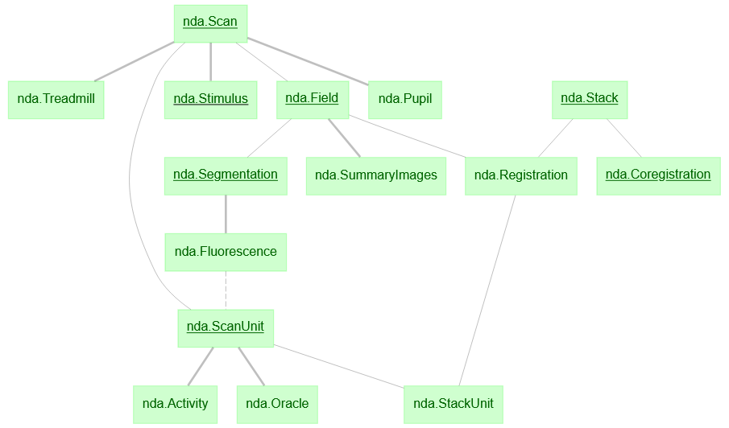

# microns_phase3_nda
nda schema for MICrONS phase3

# Installation Instructions
This package requires the em_coregistration package from the Allen Institute:

```bash
pip3 install git+https://github.com/AllenInstitute/em_coregistration.git@phase3
```

Install this package:

```bash
pip3 install git+https://github.com/cajal/microns_phase3_nda.git
```

# Import Instructions

In a jupyter notebook:

```python
from phase3 import nda, func, utils
```

Import datajoint. Configuration instructions: https://docs.datajoint.io/python/setup/01-Install-and-Connect.html

```python
import datajoint as dj
```

# Using the schema

To view schema ERD:
```python
dj.ERD(nda)
```



For tutorial see: [notebook example](notebooks/microns_phase3_nda_examples.ipynb) 

# nda table descriptions

**nda.Scan:** Information on completed scans. Cajal Pipeline source: [ScanInfo](https://github.com/cajal/pipeline/blob/6a8342bf3edb07f5653c61024742258295cd8014/python/pipeline/meso.py#L29)

**nda.Field:** Individual fields of scans. Cajal Pipeline source: [ScanInfo.Field](https://github.com/cajal/pipeline/blob/6a8342bf3edb07f5653c61024742258295cd8014/python/pipeline/meso.py#L54)

**nda.Stack:** Stack information. Cajal Pipeline source: [CorrectedStack](https://github.com/cajal/pipeline/blob/6a8342bf3edb07f5653c61024742258295cd8014/python/pipeline/stack.py#L733)

